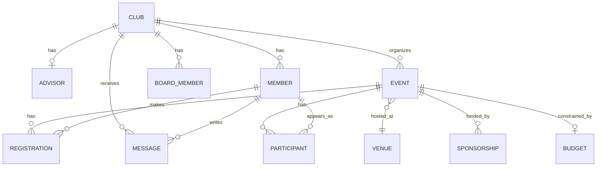

# Database Relationship Proof

## ERD (Mermaid)



## SQL Verification Queries

1. Clubs with advisor
```sql
SELECT c.name AS club, a.full_name AS advisor
FROM club c
LEFT JOIN advisor a ON a.club_id = c.id
ORDER BY c.id;
```

2. Club-member counts
```sql
SELECT c.name, COUNT(m.id) AS member_count
FROM club c
LEFT JOIN member m ON m.club_id = c.id
GROUP BY c.id, c.name
ORDER BY c.id;
```

3. Club-board member counts
```sql
SELECT c.name, COUNT(bm.id) AS board_count
FROM club c
LEFT JOIN boardmember bm ON bm.club_id = c.id
GROUP BY c.id, c.name
ORDER BY c.id;
```

4. Event with venue
```sql
SELECT e.title, v.name AS venue_name
FROM event e
LEFT JOIN venue v ON v.id = e.venue_id
ORDER BY e.id;
```

5. Event with budget
```sql
SELECT e.title, b.planned_amount, b.actual_amount
FROM event e
LEFT JOIN budget b ON b.event_id = e.id
ORDER BY e.id;
```

6. Event sponsorship totals
```sql
SELECT e.title, COALESCE(SUM(s.amount), 0) AS sponsorship_total
FROM event e
LEFT JOIN sponsorship s ON s.event_id = e.id
GROUP BY e.id, e.title
ORDER BY e.id;
```

7. Event registration counts
```sql
SELECT e.title, COUNT(r.id) AS registration_count
FROM event e
LEFT JOIN registration r ON r.event_id = e.id
GROUP BY e.id, e.title
ORDER BY e.id;
```

8. Event participant counts
```sql
SELECT e.title, COUNT(p.id) AS participant_count
FROM event e
LEFT JOIN participant p ON p.event_id = e.id
GROUP BY e.id, e.title
ORDER BY e.id;
```

9. Member activity summary
```sql
SELECT m.student_id,
       COUNT(DISTINCT r.id) AS registrations,
       COUNT(DISTINCT msg.id) AS messages,
       COUNT(DISTINCT p.id) AS participant_rows
FROM member m
LEFT JOIN registration r ON r.member_id = m.id
LEFT JOIN message msg ON msg.member_id = m.id
LEFT JOIN participant p ON p.member_id = m.id
GROUP BY m.id, m.student_id
ORDER BY m.id;
```

10. Relationship integrity check (registration)
```sql
SELECT r.id, e.title, m.student_id
FROM registration r
JOIN event e ON e.id = r.event_id
JOIN member m ON m.id = r.member_id
ORDER BY r.id;
```

## Expected Output Samples

| Check | Example |
|---|---|
| Club -> Advisor | IEEE -> Prof. Alan Turing |
| Event -> Venue | Hackathon 2026 -> Main Hall |
| Event -> Budget | Hackathon 2026 -> planned 5000 |
| Registration join | reg#1 -> Hackathon 2026 / student 1001 |

## Entity Connection Checklist

- [x] Club -> Advisor (1:0/1)
- [x] Club -> Member (1:N)
- [x] Club -> BoardMember (1:N)
- [x] Club -> Event (1:N)
- [x] Club -> Message (1:N)
- [x] Event -> Venue (N:1 optional)
- [x] Event -> Registration (1:N)
- [x] Event -> Participant (1:N)
- [x] Event -> Sponsorship (1:N)
- [x] Event -> Budget (1:0/1)
- [x] Member -> Registration (1:N)
- [x] Member -> Message (1:N)
- [x] Member -> Participant (1:N optional)
